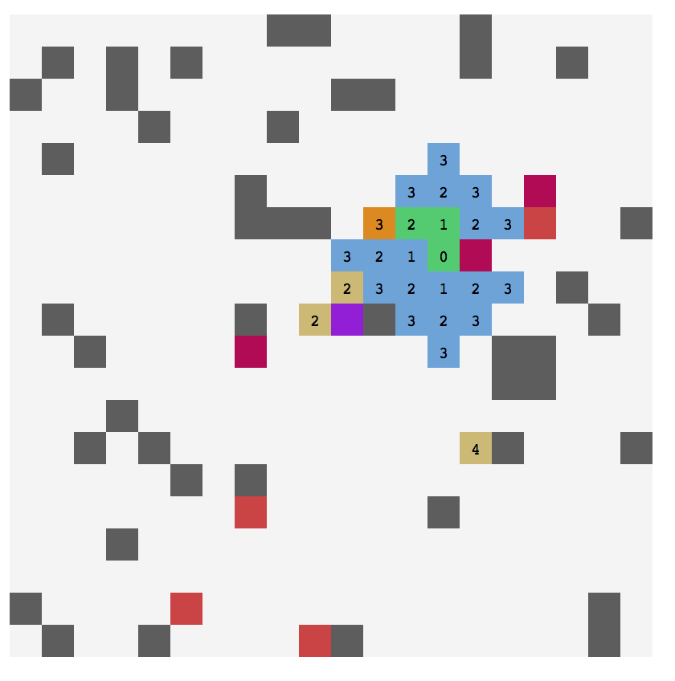
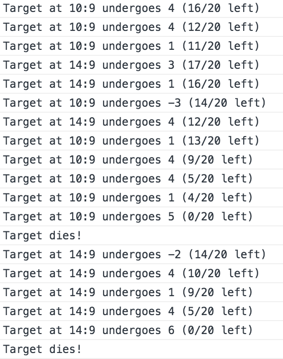

## Tactical game AI

**Tactics** is a [tactical game](https://fr.wikipedia.org/wiki/Tactical_RPG) AI test made to experiment [Utility AI](http://www.gameaipro.com/GameAIPro/GameAIPro_Chapter09_An_Introduction_to_Utility_Theory.pdf) theory looking for an AI playing on a field against itself, moving players in teams attacking each other until one of the team wins.

- [**Utility AI**](http://www.gameaipro.com/GameAIPro/GameAIPro_Chapter09_An_Introduction_to_Utility_Theory.pdf)
- **React 16** for rendering
- **Flow** for type checking

**Animated example**

**Bigger map example** involving 3 teams (yellow, red and purple). Numbers on players are last score of path finding at there position and is not relevant.

Current player is orange. Light blue zone is where the current player can move. Green is the path the player is following from his current position to the next one. Violet is the target of the current player.

### Structure

- **Core**: Main engine class managing all other parts
- **Analysis**
  - **Maps analyser**: Analyses on maps and grids
  - **Terrain analyser**: Helpers to analyse terrain and grids
    - **Path finder**: A* pathfinder (finds path and zones around a point)
      - *Instance*: Search instance
      - *Node*: A node used for A* search
- **Decision**
  - **Decision scorer**: Computes best decision to perform for a player
    - **Action scorer**: Score action of player when choosing which action to perform
    - **Position scorer**: Score position of player when choosing which position to stand
- **Engine**
  - **Game state**: Maintains state of game (players & teams playing)
  - *Action*: Something a player can perform (generally an attack)
  - *Map*: A grid with custom properties
  - *Player*: A player (NPC)
  - *Team*: A team with several players
  - *Terrain*: A collection of maps and playing teams
